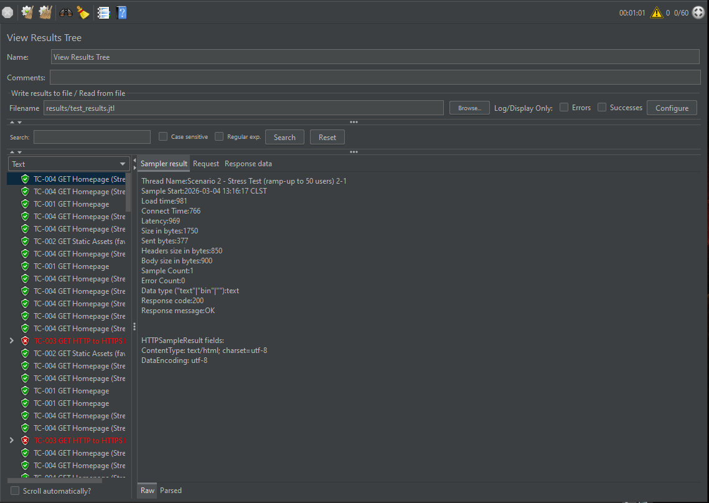
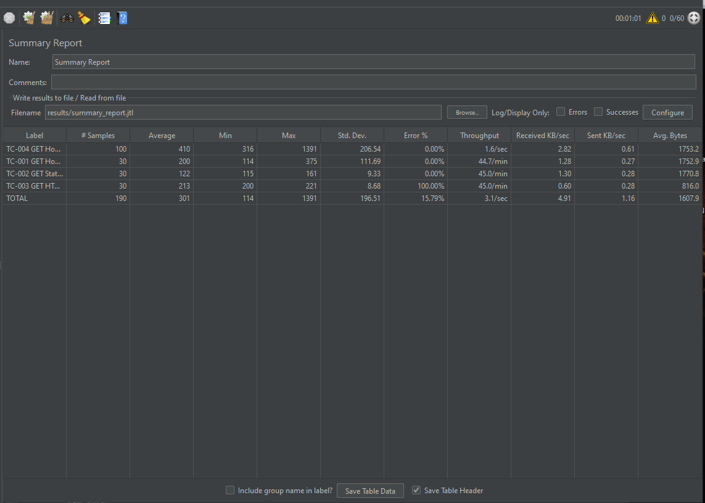
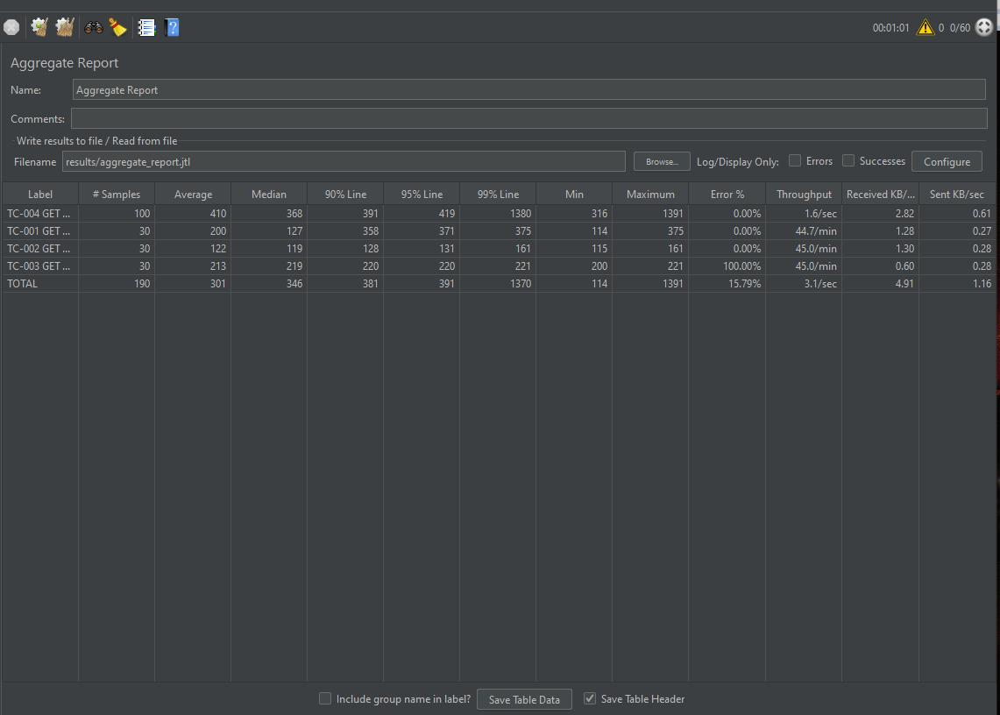
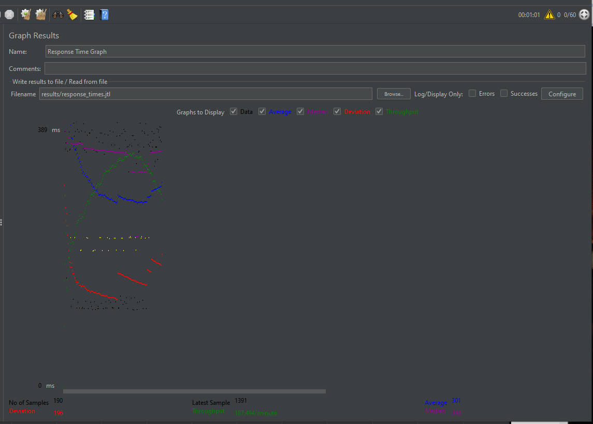

# Pruebas de Performance con JMeter para BuscaSimpsons.com

Plan de pruebas de carga y stress para [buscasimpsons.com](https://buscasimpsons.com), aplicación frontend desarrollada por mí en React.

---

## Herramientas

- Apache JMeter 5.6.3
- Java 8+

---

## Escenarios

**Escenario 1 - Prueba de Carga:** 10 usuarios simultáneos, 3 iteraciones, ramp-up de 30 segundos.

**Escenario 2 - Prueba de Stress:** 50 usuarios simultáneos, 2 iteraciones, ramp-up de 60 segundos.

---

## Casos de Prueba

| ID     | Descripción                        | Resultado |
|--------|------------------------------------|-----------|
| TC-001 | GET Página principal               | PASS      |
| TC-002 | GET Recurso estático (favicon)     | PASS      |
| TC-003 | Redirección HTTP a HTTPS           | FAIL*     |
| TC-004 | GET Página principal (stress)      | PASS      |

*El servidor no expone el puerto 80 (HTTP), lo cual es una práctica de seguridad válida.

---

## Resultados

### View Results Tree

### Summary Report

### Aggregate Report

### Response Time Graph

---

## Conclusiones

- La página principal respondió en promedio **200ms** bajo carga normal y **410ms** bajo stress, ambos dentro del umbral aceptable.
- Tasa de error **0%** en todos los casos funcionales.
- El sitio soportó los 50 usuarios simultáneos sin caídas ni errores.
- TC-003 falla porque el servidor no expone el puerto HTTP (80), lo que es correcto desde el punto de vista de seguridad.

---
